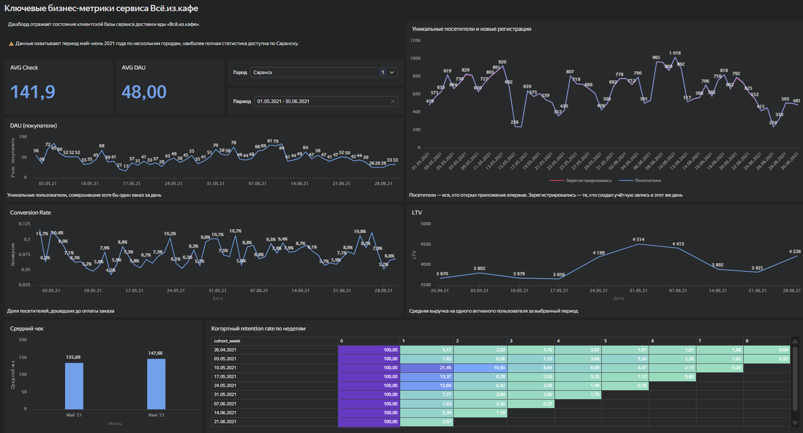

#  Дашборд: ключевые бизнес-метрики сервиса "Всё.из.кафе"

 [Открыть дашборд](https://datalens.ru/9c71x60xwwoat)

---

## Превью



---

## Задача
Построить дашборд для мониторинга ключевых продуктовых и бизнес-метрик сервиса
доставки еды «Всё.из.кафе», чтобы отслеживать поведение пользователей, динамику
привлечения и экономику заказов за май–июнь 2021 года.

---

## Что сделано
- рассчитаны ключевые метрики: DAU, конверсия в заказ, средний чек, LTV
- построена динамика новых посетителей и зарегистрированных пользователей по дням
- реализован когортный анализ retention по неделям
- добавлены фильтры по городу и периоду через селекторы
- часть чартов реализована как QL-чарты с прямыми SQL-запросами к PostgreSQL

---

## Ключевые выводы
- retention резко снижается от когорты к когорте: майская аудитория возвращалась
  на первой неделе в 20%, июньская — уже в 2–5%
- рост новых пользователей в июне не конвертировался в заказы — вероятно,
  привлекалась нецелевая аудитория
- LTV стабилен на протяжении всего периода — проблема не в экономике заказа,
  а в качестве привлечения и удержании

---

## Стек
DataLens, SQL, PostgreSQL

---

## Структура дашборда
- индикаторы: AVG DAU и средний чек за период
- динамика DAU по дням
- новые посетители и зарегистрированные пользователи по дням
- конверсия в заказ по дням
- LTV по неделям
- средний чек по месяцам
- когортный retention rate по неделям
- селекторы по городу и периоду

---

<details>
<summary>Примеры SQL-запросов (QL-чарты)</summary>
```sql
-- Средний DAU с фильтрацией по городу и периоду
SELECT ROUND(AVG(daily_users), 0) AS "Средний DAU"
FROM (
    SELECT log_date,
           COUNT(DISTINCT user_id) AS daily_users
    FROM rest_analytics.analytics_events AS events
    JOIN rest_analytics.cities AS cities ON events.city_id = cities.city_id
    WHERE event = 'order'
      AND cities.city_name IN {{city_name}}
      AND log_date BETWEEN {{interval_from}} AND {{interval_to}}
    GROUP BY log_date
) AS daily;

-- Новые посетители и зарегистрированные по дням
SELECT
    CAST(log_date AS date) AS log_date,
    COUNT(DISTINCT visitor_uuid) AS "Посетители",
    COUNT(DISTINCT CASE WHEN event = 'authorization'
          THEN visitor_uuid END) AS "Зарегистрировались"
FROM rest_analytics.analytics_events AS events
JOIN rest_analytics.cities AS cities ON events.city_id = cities.city_id
WHERE cities.city_name IN {{city_name}}
    AND log_date BETWEEN {{interval_from}} AND {{interval_to}}
GROUP BY CAST(log_date AS date)
ORDER BY CAST(log_date AS date);
```

</details>
